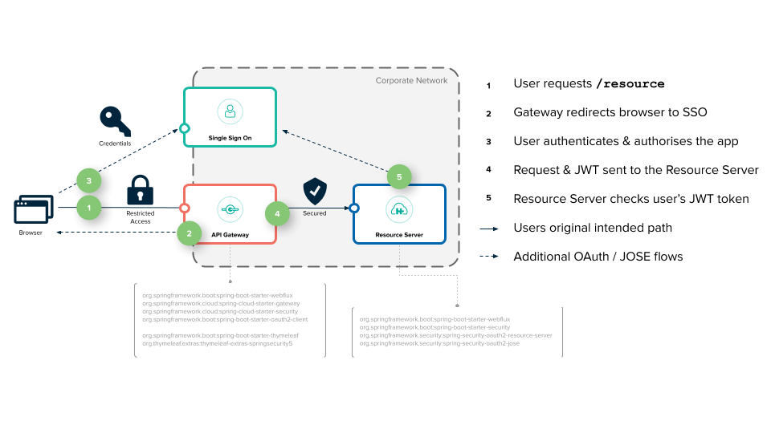

# User Center Spring cloud 

> 用户中心采用微服务英文名称Microservice，Microservice架构模式就是将整个Web应用组织为一系列小的Web服务。这些小的Web服务可以独立地编译及部署，并通过各自暴露的API接口相互通讯。它们彼此相互协作，作为一个整体为用户提供功能，却可以独立地进行扩。

### 微服务架构需要的功能或使用场景

 - 1：我们把整个系统根据业务拆分成几个子系统。

 - 2：每个子系统可以部署多个应用，多个应用之间使用负载均衡。

 - 3：需要一个服务注册中心，所有的服务都在注册中心注册，负载均衡也是通过在注册中心注册的服务来使用一定策略来实现。

 - 4：所有的客户端都通过同一个网关地址访问后台的服务，通过路由配置，网关来判断一个URL请求由哪个服务处理。请求转发到服务上的时候也使用负载均衡。

 - 5：服务之间有时候也需要相互访问。例如有一个用户模块，其他服务在处理一些业务的时候，要获取用户服务的用户数据。

 - 6：需要一个断路器，及时处理服务调用时的超时和错误，防止由于其中一个服务的问题而导致整体系统的瘫痪。

 - 7：还需要一个监控功能，监控每个服务调用花费的时间等。
 
 
 
 ### 开源技术引用 
 
 一、OAuth2 简介
	OAuth 2.0 是一个开放标准的授权协议，它允许用户授权第三方应用访问其在另一个服务提供商处存储的受保护资源，而无需将自己的用户名和密码直接提供给第三方应用。这极大地增强了用户数据的安全性和隐私性，广泛应用于各种需要第三方授权访问的场景，如社交登录、第三方应用获取用户在云存储服务中的文件等。
	
  

  	
  

### 与传统认证方式的对比
  传统认证方式：通常要求用户直接向第三方应用提供其在服务提供商处的用户名和密码，这存在密码泄露的风险。一旦第三方应用的安全性出现问题，用户的账户信息将面临严重威胁。
OAuth 2.0：用户只需在服务提供商的授权页面上进行授权操作，第三方应用获得的是访问令牌（Access Token），而非用户的原始凭据。即使令牌泄露，攻击者也只能在令牌的有效期和权限范围内访问资源，且令牌可以被服务提供商随时撤销。
#### 常见应用场景
  社交登录：许多网站和应用允许用户使用社交媒体账号（如微信、QQ、微博、Google、Facebook 等）进行登录。用户无需在新平台上注册新账号，只需授权平台访问其社交账号的基本信息，即可快速完成登录。
第三方数据访问：例如，一个健身应用可以请求用户授权访问其在运动追踪服务提供商处的运动数据，以便为用户提供更全面的健身分析和建议。
API 访问：开发者在开发第三方应用时，需要调用某些服务提供商的 API 来获取数据或执行操作。通过 OAuth 2.0 授权，开发者可以在不暴露用户敏感信息的情况下，合法地使用这些 API。

 		1.授权码模式（Authorization Code）：适用于有后端支持的应用，安全性高。
 		2.简化模式（Implicit Grant）：适用于无后端支持的客户端应用（如单页面应用，SPA）。
 		3.密码模式（Password）：适用于用户信任客户端应用的场景。
 		4.客户端模式（Client Credentials）：适用于客户端应用访问自己的资源。
 二、 JWT (JSON Web Token)
 	What is JSON Web Token?
		JSON Web Token (JWT) is an open standard (RFC 7519) that defines a compact and self-contained way for securely transmitting information between parties as a JSON object. This information can be verified and trusted because it is digitally signed. JWTs can be signed using a secret (with the HMAC algorithm) or a public/private key pair using RSA or ECDSA.

		Although JWTs can be encrypted to also provide secrecy between parties, we will focus on signed tokens. Signed tokens can verify the integrity of the claims contained within it, while encrypted tokens hide those claims from other parties. When tokens are signed using public/private key pairs, the signature also certifies that only the party holding the private key is the one that signed it.

##### Signature
		To create the signature part you have to take the encoded header, the encoded payload, a secret, the algorithm specified in the header, and sign that.

		For example, if you want to use the HMAC SHA256 algorithm, the signature will be created in the following way:

		HMACSHA256(
			base64UrlEncode(header) + "." +
			base64UrlEncode(payload),
			secret
		)
		The signature is used to verify the message wasn't changed along the way, and, in the case of tokens signed with a private key, it can also verify that the sender of the JWT is who it says it is.